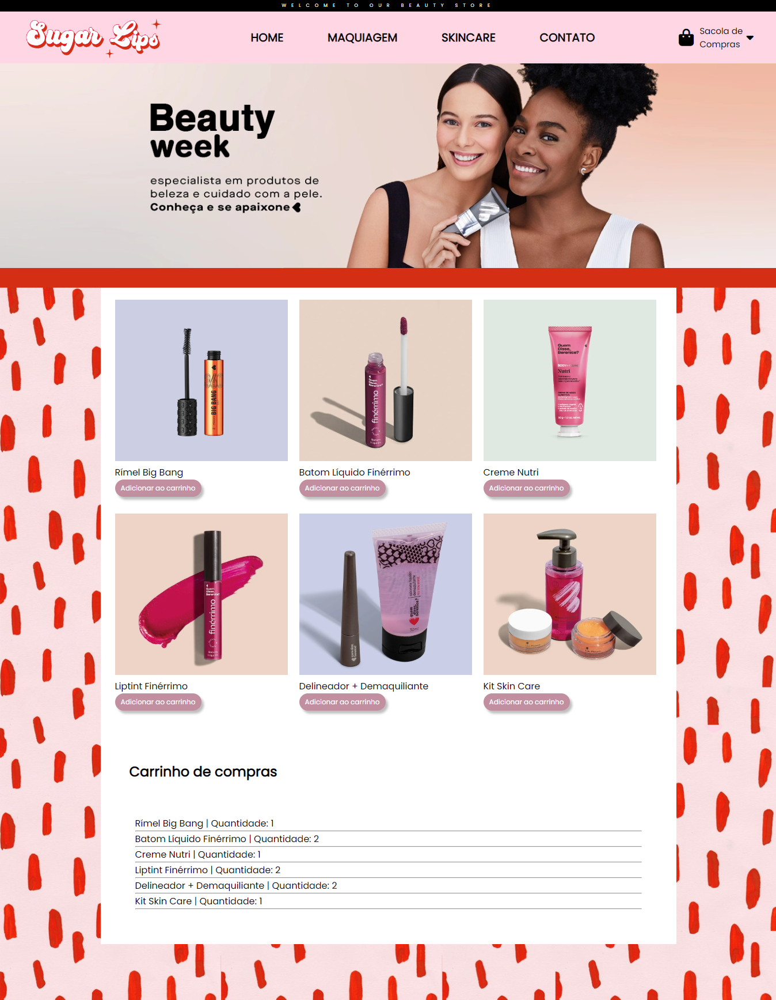

  

Projeto autoral desenvolvido com o objetivo de aprimorar e consolidar o aprendizado em Javascript.

O foco principal foi treinar condicionais, laços de repetição e criação dos produtos de forma dinâmica.

  <a href="#-tecnologias">Tecnologias</a>&nbsp;&nbsp;&nbsp;|&nbsp;&nbsp;&nbsp;
  <a href="#-projeto">Projeto</a>&nbsp;&nbsp;&nbsp;|&nbsp;&nbsp;&nbsp;
  <a href="#memo-licença">Licença</a>

  

 

  

  

## 🚀 Tecnologias

Esse projeto foi desenvolvido com as seguintes tecnologias:

- HTML e CSS
- JavaScript 
- Git e Github
  

## 💻 Projeto

Sugar Lips é um e-commerce fictício desenvolvido para ilustrar o projeto de e-commerce 
Onde é possivel adicionar os produtos ao carrinho, finalizar a compra e testar métodos de pagamento 
Algumas funções estão em desenvolvimento
Você pode visualizar o projeto [AQUI](https://erikamattje.github.io/ecommerce-sugarlips/)
  
## 🔖 Icones

- :package: Novas funcionalidades  
- :up: Atualizações  
- :computer: Troca de computadores  
- :bug: Correção de bug  
- :checkered_flag: Release  
  
## :memo: Licença

Esse projeto está sob a licença MIT.

